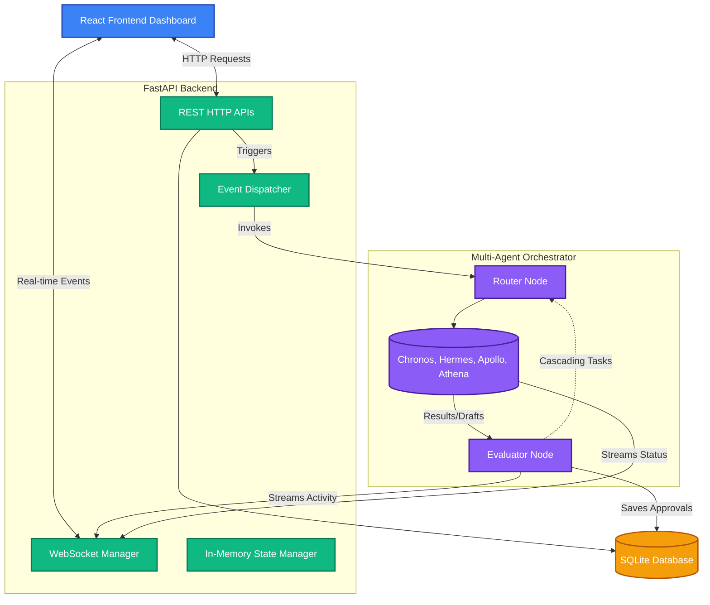
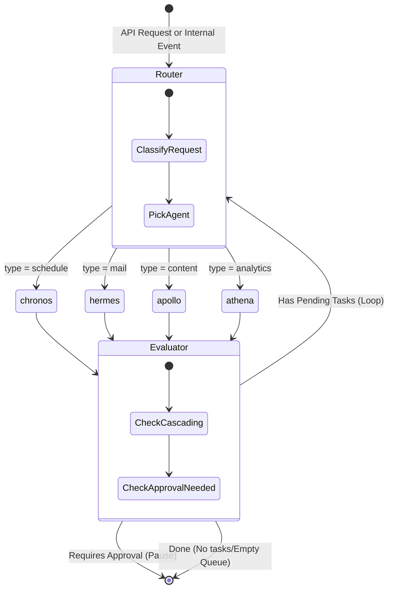
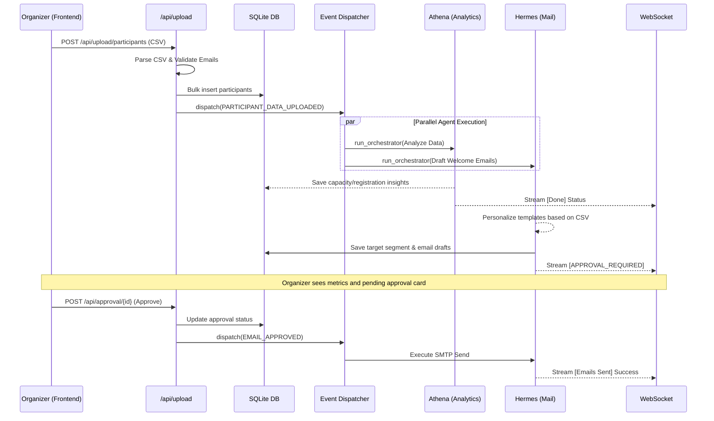
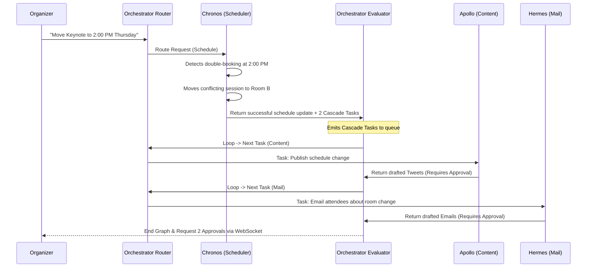
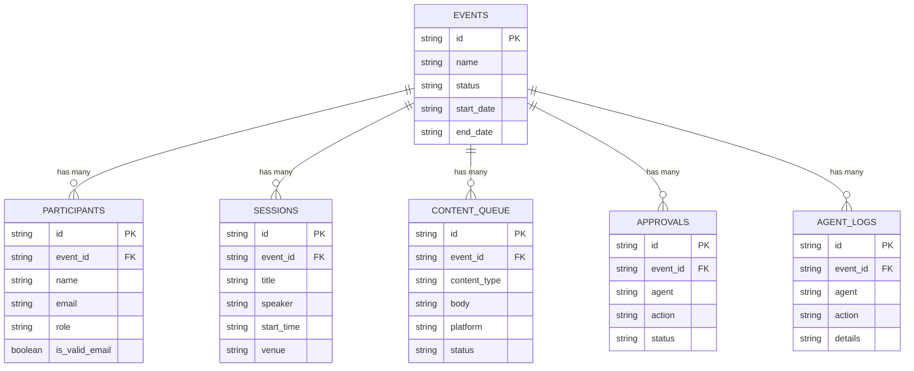

# Nexus Event Intelligence Platform — System Diagrams

This document contains visual diagrams outlining the core architecture, orchestration flows, and database structures of the Nexus backend.

## 1. High-Level System Architecture

This diagram shows how the React Frontend interacts with the FastAPI backend, and how the backend manages the SQLite database, real-time WebSocket streams, and the LangGraph orchestration engine.

---

## 2. LangGraph Orchestrator Flow

This flow illustrates the underlying state machine that powers the `NexusState` inside `app/agents/orchestrator.py`. It shows how requests are routed and how agents are evaluated for cascading tasks or human approvals.

---

## 3. Autonomous Workflow: CSV Upload Event

This sequence diagram details exactly what happens across the system when an organizer uploads a participant CSV file.

---

## 4. Automatic Conflict Resolution & Cascading

This sequence demonstrates how a single manual request triggers a chain reaction between multiple agents via the `Evaluator` node.

---

## 5. Database Entity Relationship Diagram (ERD)

How the core SQLite tables relate to one another to store event memory and logs.

